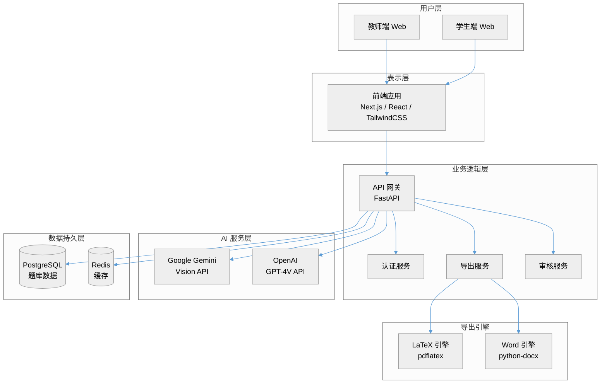
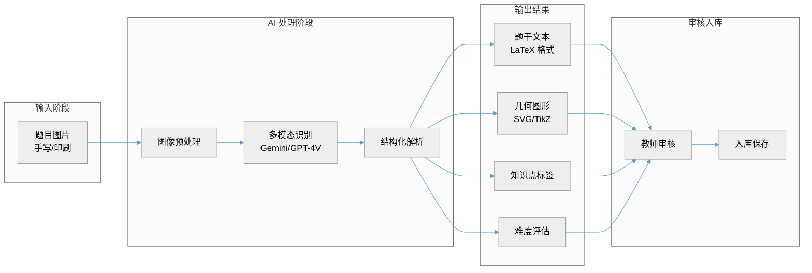
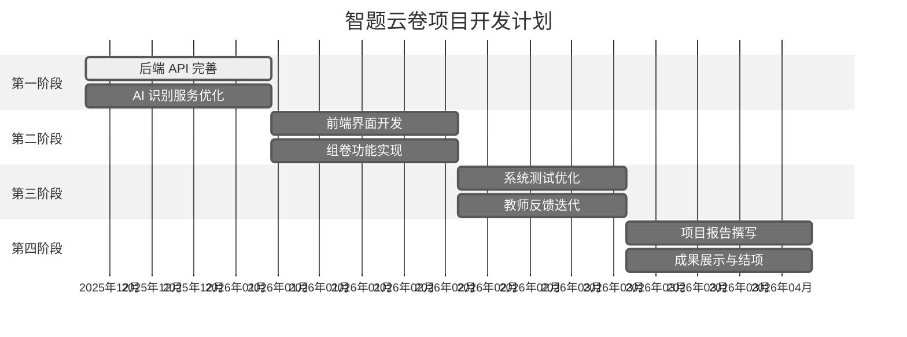
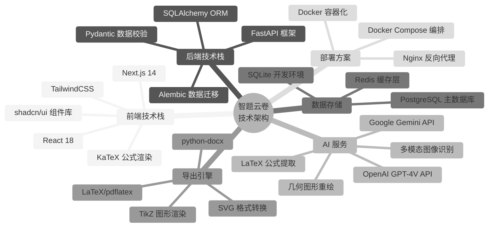
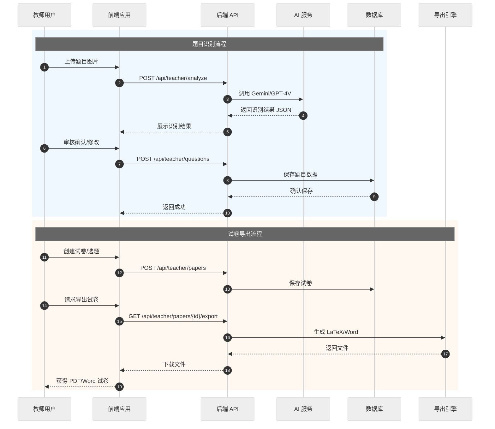
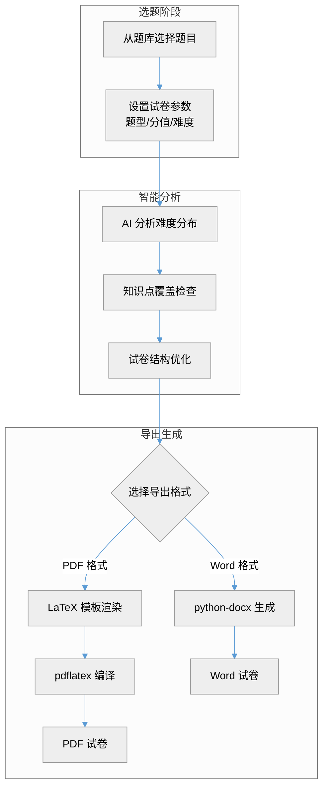

# 北京师范大学乐育书院"乐创杯"师范生微科普实践大赛申报书

---

## 基本信息

| 项目形式 | ☑ 教具制作 |
|---------|----------|
| **项目名称** | **智题云卷——AI驱动的智能组卷与教学辅助平台** |
| **负责人姓名** | 陶思宇 |
| **指导教师** | （请填写） |
| **填表日期** | 2025年   月   日 |

---

## 一、项目负责人及参与者情况

### 项目负责人基本情况

| 项目 | 内容 |
|------|------|
| 姓名 | 陶思宇 |
| 性别 | 男 |
| 民族 | 汉 |
| 学号 | 202411078123 |
| 年级班级 | 数学与应用数学 |
| 手机 | 13378256469 |
| 微信号 | canfen2026 |
| 电子邮箱 | siyutao@mail.bnu.edu.cn |

### 参与者情况（不包括项目负责人和导师）

| 姓名 | 性别 | 民族 | 学号 | 年级班级 | 手机 | 微信号 | 电子邮箱 |
|------|------|------|------|----------|------|--------|----------|
| | | | | | | | |
| | | | | | | | |

---

## 二、项目研究方案

### （一）项目背景

#### 1. 项目提出的背景

在中学数学教学中，教师日常需要大量时间进行试卷编制、题目整理和教学资源管理。传统组卷方式存在以下痛点：

- **录入效率低**：手动录入题目耗时费力，尤其是包含复杂数学公式和几何图形的题目
- **管理分散**：题库管理分散，难以快速检索相似题目
- **技术门槛高**：试卷排版需要专业 LaTeX 知识，普通教师难以掌握
- **缺乏智能分析**：缺乏智能化的难度分析和知识点覆盖评估工具

#### 2. 学科领域现状

当前市面上的组卷系统多为传统数据库检索模式，存在以下局限：

- OCR 识别对数学公式支持不佳，识别准确率低
- 题目搜索依赖关键词匹配，语义理解能力弱
- 导出格式单一，排版质量参差不齐
- 缺乏 AI 辅助的智能分析功能

#### 3. 理论与实践意义

**理论意义：**
- 探索多模态大模型（Gemini/GPT-4V）在教育领域的应用
- 研究 AI 辅助教学工具的设计范式
- 为教育信息化提供技术参考

**实践意义：**
- 为中学数学教师提供高效的组卷工具，预计可节省 50% 以上的试卷编制时间
- 为师范生提供现代教育技术实践平台
- 推动 AI 技术在基础教育中的落地应用

---

### （二）项目简介

#### 1. 主要内容

本项目开发一套基于 AI 的智能组卷与教学辅助平台"智题云卷"，核心功能包括：

**功能一：智能 OCR 识别**
- 上传手写或印刷体题目图片
- AI 自动转换为标准 LaTeX 格式
- 完美还原数学公式与几何图形（支持 TikZ/SVG）

**功能二：语义题库搜索**
- 基于向量嵌入的语义检索
- 精准匹配相似题目
- 支持知识点、难度等多维度筛选

**功能三：AI 辅助组卷**
- 智能分析试卷难度与知识点分布
- 自动生成专业排版的 PDF/Word 试卷
- 支持自定义试卷模板

**功能四：题目审核管理**
- 支持教师对 AI 识别结果进行审核、修改
- 题目入库与版本管理
- 多用户协作支持

#### 图1 系统整体架构图

#### 2. 重点难点

| 类型 | 具体内容 |
|------|----------|
| **重点** | 数学公式与几何图形的高精度 OCR 识别 |
| **重点** | LaTeX 试卷模板的自动化排版与导出 |
| **难点** | AI 识别结果的 JSON 解析与容错处理 |
| **难点** | 复杂几何图形的 SVG/TikZ 精确重绘 |

#### 3. 主要观点和创新之处

**创新点一：多模态大模型驱动**
- 采用 Gemini/GPT-4V 进行题目识别
- 支持复杂数学公式和几何图形的精确还原
- 识别准确率显著高于传统 OCR

**创新点二：双引擎架构设计**
- 统一 AI 服务层，支持 Gemini 和 OpenAI 双引擎切换
- 适应不同部署环境和成本需求
- 提供灵活的 API 扩展能力

**创新点三：专业试卷排版**
- 基于 exam-zh LaTeX 模板
- 符合中国高考试卷排版规范
- 支持 PDF 和 Word 双格式导出

#### 4. 基本思路和方法

#### 图2 题目识别与入库流程图

**技术栈选型：**

| 层次 | 技术选型 | 说明 |
|------|----------|------|
| 前端 | Next.js 14 + React 18 + TailwindCSS | 现代化 Web 框架 |
| 后端 | FastAPI + SQLAlchemy + Pydantic | 高性能 Python API |
| AI | Google Gemini / OpenAI GPT-4V | 多模态大模型 |
| 数据库 | PostgreSQL / SQLite | 关系型数据库 |
| 导出 | LaTeX (pdflatex) + python-docx | 专业排版引擎 |
| 部署 | Docker + Docker Compose | 容器化部署 |

---

### （三）项目计划安排

#### 图3 项目开发计划甘特图

| 阶段 | 时间 | 主要任务 | 预期成果 |
|------|------|----------|----------|
| 第一阶段 | 2025年12月-2026年1月 | 后端 API 完善，AI 识别服务优化 | 完善核心 API，提升识别准确率 |
| 第二阶段 | 2026年1月-2月 | 前端界面开发，组卷功能实现 | 完成 Web 界面，支持组卷导出 |
| 第三阶段 | 2026年2月-3月 | 系统测试优化，收集教师反馈 | 系统稳定运行，功能完善 |
| 第四阶段 | 2026年3月-4月 | 项目报告撰写，成果展示与结项 | 完成结题报告，项目验收 |

---

### （四）预期成果应用展望

#### 1. 教学应用价值

- 为中学数学教师提供高效的组卷工具
- 预计可节省 **50% 以上**的试卷编制时间
- 提升试卷排版的专业性和规范性

#### 2. 师范生培养价值

- 作为教育技术实践项目，帮助师范生掌握 AI 辅助教学的前沿技术
- 培养师范生的信息化教学能力
- 为未来教师职业发展奠定技术基础

#### 3. 推广应用价值

- 系统开源后可供其他学科（物理、化学）扩展使用
- 可推广至其他师范院校使用
- 为中小学教育信息化提供参考方案

#### 4. 科普教育价值

- 展示 AI 在教育领域的实际应用
- 提升公众对教育信息化的认知
- 促进 AI 技术的科普传播

---

### （五）可行性分析

#### 1. 技术可行性

| 方面 | 现状 | 可行性评估 |
|------|------|------------|
| 后端开发 | 已完成 FastAPI 框架搭建、AI 服务集成、LaTeX 导出 | ✅ 已验证 |
| 前端开发 | 已搭建 Next.js 基础框架 | ✅ 技术成熟 |
| AI 识别 | Gemini/GPT-4V 多模态能力成熟 | ✅ API 可用 |
| 导出功能 | LaTeX/python-docx 方案已验证 | ✅ 已实现 |

#### 2. 团队可行性

- 项目负责人具备 Python/JavaScript 全栈开发能力
- 熟悉 LaTeX 排版和数学公式处理
- 有 AI 大模型 API 调用和 Prompt 工程经验
- 数学专业背景，理解教学需求

#### 3. 资源可行性

| 资源类型 | 需求 | 解决方案 |
|----------|------|----------|
| 开发环境 | 个人电脑 | 已具备 |
| AI 服务 | Gemini/OpenAI API | 免费额度 + 少量付费 |
| 服务器 | 云服务器部署 | 学生优惠云服务 |
| 测试数据 | 数学题目样本 | 公开题库 + 教材 |

#### 4. 风险评估与应对

| 风险 | 可能性 | 应对措施 |
|------|--------|----------|
| AI API 调用成本超支 | 中 | 设置调用限额，优化 Prompt |
| 识别准确率不足 | 低 | 人工审核机制，持续优化 |
| 开发进度延迟 | 中 | 模块化开发，优先核心功能 |

---

## 三、申请资助金额和经费预算

| 总经费 | **500 元** |
|--------|-----------|

### 经费支出预算

| 序号 | 预算支出项目 | 事由及测算依据 | 预计支出金额（元） |
|------|-------------|---------------|------------------|
| 1 | 云服务器费用 | 阿里云/腾讯云学生机，用于系统部署测试，约 50 元/月 × 6 个月 | 300 |
| 2 | AI API 调用费用 | Gemini/OpenAI API 超出免费额度的调用费用 | 100 |
| 3 | 域名费用 | .cn 域名注册，用于系统访问 | 50 |
| 4 | 图书资料费 | LaTeX 排版、AI 应用相关技术书籍 | 50 |
| | **合计** | | **500** |

---

## 四、项目未受资助及未获奖、发表确认签名

**项目未受课题资助确认：**

申请人签名：________________　　　　　　指导教师签名：________________

**项目未获奖或公开发表确认：**

申请人签名：________________　　　　　　指导教师签名：________________

---

## 五、指导教师简况

| 项目 | 内容 |
|------|------|
| 姓名 | （请填写） |
| 性别 | |
| 民族 | |
| 出生年月 | |
| 工作单位 | |
| 职务 | |
| 联系方式 | |

---

## 六、指导教师对该项目的评价

### （一）对申请课题的价值、研究方案的可行性、工作基础等方面的评价与建议

（由指导教师填写）

### （二）对项目团队的专业基础、工作态度、学风及研究能力的评价与建议

（由指导教师填写）

**指导教师（签名）：**________________

**日期：**______年______月______日

---

## 七、书院审核意见

**专家评审意见：**

□ 同意　　　□ 不同意

**签章：**________________

**日期：**______年______月______日

---

## 附录

### 图4 技术栈组成图

---

### 图5 系统数据流时序图

---

### 图6 组卷导出流程图

---

> **图表说明：**
> - 图1：展示系统整体分层架构，包括用户层、表示层、业务逻辑层、AI服务层、数据持久层
> - 图2：展示题目从图片输入到入库保存的完整处理流程
> - 图3：展示项目四个阶段的时间安排和任务分配
> - 图4：展示项目所采用的技术栈组成
> - 图5：展示系统各组件之间的数据交互时序
> - 图6：展示从选题到导出试卷的完整业务流程
