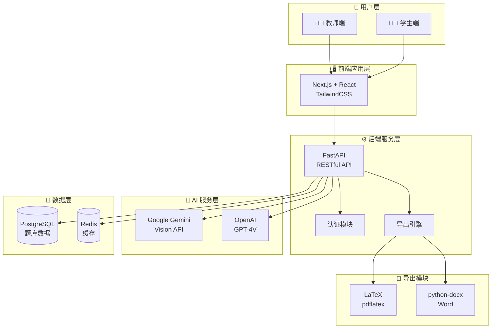
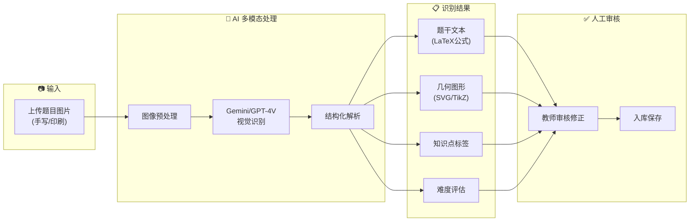
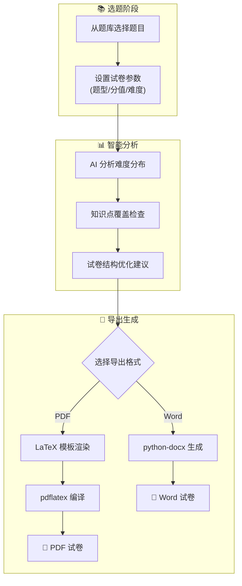
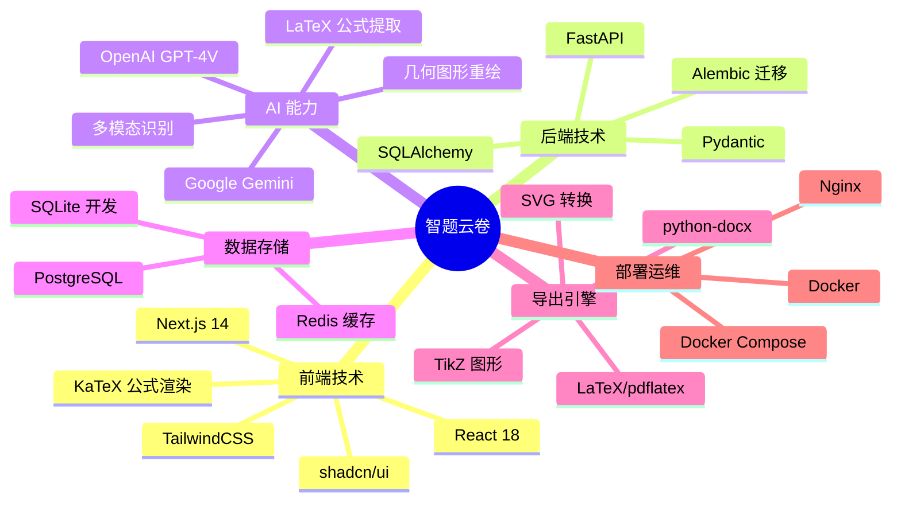
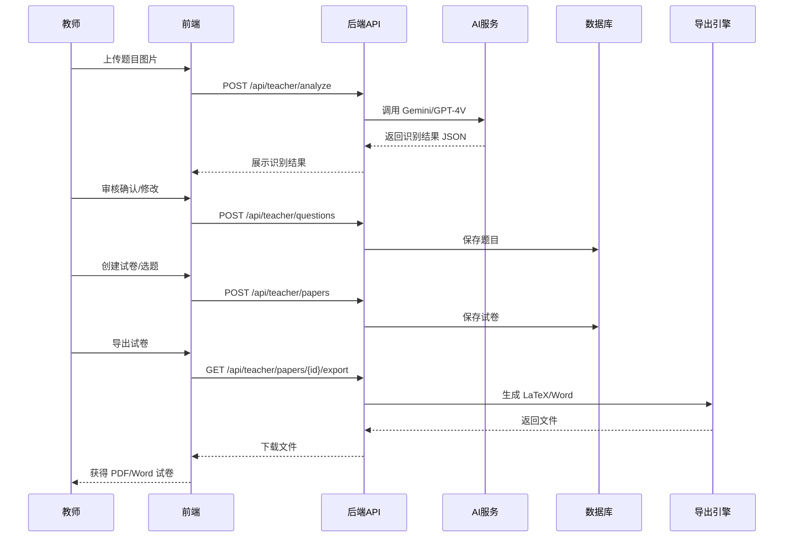
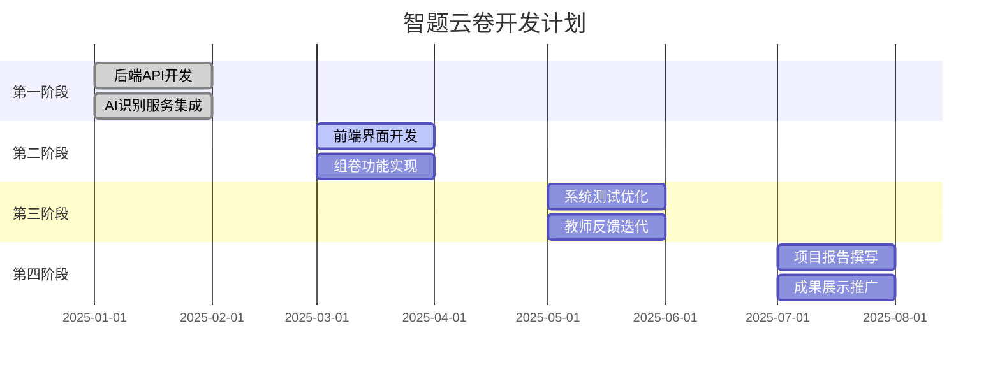

# 智题云卷 - 申报书配图

> 以下图表使用 Mermaid 语法，可在 Typora、VS Code、语雀、飞书等工具中直接渲染
> 渲染后截图即可用于申报书

---

## 图1：系统整体架构图

---

## 图2：AI 题目识别流程图

---

## 图3：智能组卷与导出流程

---

## 图4：技术栈全景图

---

## 图5：数据流向图

---

## 图6：项目计划甘特图

---

## 使用说明

1. 复制上述 Mermaid 代码块
2. 粘贴到支持 Mermaid 的编辑器中渲染
3. 截图保存为 PNG/JPG
4. 插入到申报书 Word 文档中

**推荐渲染工具：**
- Typora（本地）
- VS Code + Markdown Preview Mermaid 插件
- [Mermaid Live Editor](https://mermaid.live)（在线）
- 语雀/飞书文档（在线）
